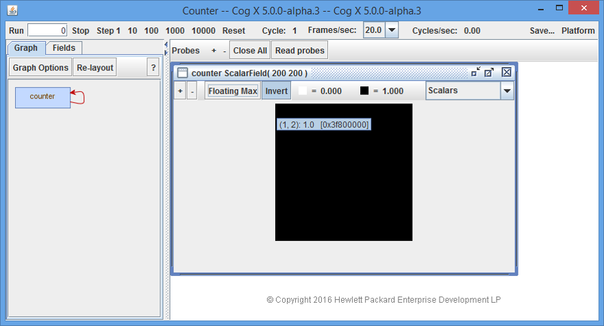

#Getting Started

The HPE Cognitive Computing Toolkit (CCT) is a GPU-accelerated platform for deep learning and other advanced analytics. The **cct-tutorial** contains a number of examples from each of the repositories that comprise the Cognitive Computing Toolkit. This guide along with the examples in this tutorial can be used to get an introduction to the CCT platform.

*   [Intro](#intro)
*   [Abstractions](#abstractions)
*   [Introductory Examples](#introductory-examples)
*   [Tensor Fields](#tensor-fields)
      *    [Sensors](#sensors)
         *    [cct-io Sensors](#cct-io-sensors)
         *    [cct-nn Sensors](#cct-nn-sensors)
      *    [Actuators](#actuators)
*   [Operators](#operators)
      * [Built-in Operators](#built-in-operators)   
      * [The Feedback Operator](#the-feedback-operator)
      * [User-defined GPU Operators](#user-defined-gpu-operators)  
      * [User-defined CPU Operators](#user-defined-cpu-operators)  
*   [Compute Graph](#compute-graph)
*   [Neural Network Toolkit](#neural-network-toolkit)
*   [Programming CCT Applications](#programming-cct-applications)
*   [Visual Debugger](#visual-debugger)
*   [Other Tidbits](#other-tidbits)

## Intro

The CCT platform is software platform for developing-massively parallel applications that execute on multi-core processors such as GPUs. CCT differs from most other parallel programming paradigms (such as MPI, actors, transactional memory) by exposing the parallelism implicitly in the programming model rather than through explicit mechanisms and data structures. The model contains no threads, locks, message queues, critical sections, or races. It is a deterministic, massively-parallel programming model. It is also a declarative dataflow programming model, meaning that a CCT application describes the structure of the computation, not sequential actions.

For more detailed information, a draft of the CCT programming guide is available
[here](http://hpe-cct.github.io/docs/CogProgrammingTutorial_4_1.pdf). Note that
this is an early document, and still refers to CCT by its original internal
working name (Cog ex Machina or Cog).

### Language

CCT is written in the Scala programming language which runs on the Java Virtual Machine (JVM).

### Libraries 

The CCT platform consists of several libraries, each contained in separate github repositories, under the `hpe-cct` root directory. The **cct-tutorial** has dependencies on these libraries.

**cct-core** - This is the core library and API. It contains the compiler and runtime system necessary to optimize and distribute a CCT application. This package is currently imported as `libcog`. The **cct-core** repository also contains the visual debugger, `cogdebugger`, though it is in a separate package. 

**cct-io** - This library provides a set of objects which can be used for getting data into and out of a running CCT application using the field initialization, *sensor*, and *actuator* primatives that are part of the cct-core API. For example, it has APIs to read an image file or movie file. This package is currently imported into some of the tutorial examples as `cogio`.

**cct-nn** - This library provides APIs to support deep learning and neural networks. This package is currently imported into some of the tutorial examples as `toolkit.neuralnetwork`.

**cct-sandbox** - This library contains unstable CCT libraries for applications including signal processing and computer vision.

**cogdebugger** - This is a UI Wrapper for debugging CCT applications. It allows developers to visualize the *compute graph*, inspect the *fields*, and step through the *compute graph*. The visual debugger is part of the **cct-core** library, but the package is imported separately as `cogdebugger`.

## Abstractions

The CCT programming model has three core abstractions: *tensor fields*, *operators*, and *compute graphs*.  

* A *tensor field* is a multidimensional array (field) of multidimensional arrays (tensors) of elements (e.g. 32-bit floating point numbers). These fields are used for inputs, outputs, computations, and persistent state. 
* An *operator* combines one or more *tensor fields* to create a new *tensor field*. 
* A *compute graph* combines *tensor fields* and *operators* into a single, massively-parallel unit of computation. 
 
The *compute graph* is a state machine, which evolves in discrete time. A single tick, or "step" of the CCT clock sends the input data through the entire *compute graph* to its outputs. Persistent state, for learning and adaptation, is handled using feedback. The state of a *tensor field* can be updated at each step and fed back into the *compute graph* at the next step, providing control loops and learning.

Using these simple abstractions, the CCT compiler optimizes the computation across *operators* and can distribute the work efficiently to scale from one CPU to clusters with millions of GPU cores.

This figure shows a small *compute graph* consisting of one sensor supplying external data to a *tensor field*. A second *tensor field* gets updated using the feedback *operator*. The two *tensor fields* are combined using an *operator* to produce a third *tensor field*, which has an actuator to feed the result to an external consumer.

The next section shows two examples to introduce the basic abstractions. The sections that follow it drill down with more details on each of these abstractions.

## Introductory Examples

Here are two examples to get started with.  

### Example #1
`Counter` is a very simple example of a *compute graph* with one *tensor field* and one *operator*. Here is the code:

    package tutorial.libcog.fields

    import cogdebugger._
    import libcog._
    
    object Counter extends CogDebuggerApp(
      new ComputeGraph {
        val counter = ScalarField(200, 200)
        counter <== counter + 1
      }
    )

It can also be found [here](https://github.com/hpe-cct/cct-tutorial/blob/master/src/main/scala/tutorial/libcog/fields/Counter.scala) and at this location  in your IDE: `./cct-tutorial/src/scala/tutorial/libcog/fields/Counter.scala`.

This program defines one *tensor field*, `counter`, which is a 2-dimensional scalar field with 200 rows and 200 columns. It uses the feedback *operator* `<==` to increment itself by 1 with each clock tick (or step) of the *compute graph*.

This next figure shows `Counter` running in the visual debugger. 

The visual debugger is a graphical tool that allows you to step, reset, and "peek inside" a `ComputeGraph` to visualize the computation while it executes. 

Referring to the figure above, one can click on the blue box labeled "counter" in the left pane to open the "counter" window in the right-pane (as shown here). The "counter" window on the right shows that the "counter" field is a `ScalarField` with a size of 200 by 200. Placing the cursor over a point in the field momentarily brings up a tooltip displaying the coordinates and value at that point. In this case, value is "1.0" at the location (1,2) after stepping through the *compute graph* one time. 

The "Cycle" value at the top shows how many steps have been taken, which in this case is "1". All 40,000 points have a value of "1" after 1 cycle. 

The buttons at the top left allow you to control stepping through the *compute graph*. Clicking "Step 1" will step once, which will add 1 to every point in "counter". This is 40,000 additions. Clicking "Run" with a "0" in the adjacent box, steps through the *compute graph* until "Stop" is clicked. Clicking "Reset" resets the *compute graph* fields back to their initial state.  

### Example #2

`BackgroundSubtraction` is another good example to illustrate several more concepts covered in this tutorial. Here is the code:

    package tutorial.cogio

    import cogdebugger.CogDebuggerApp
    import cogio._
    import libcog._

    object BackgroundSubtraction extends CogDebuggerApp (
      new ComputeGraph {
        val movieFile = "resources/courtyard.mp4"
        val movie = ColorMovie(movieFile, synchronous = false)
        val movieVector = vectorField(movie)
        val background = VectorField(movie.fieldShape, Shape(3))
        background <== 0.999f*background + 0.001f*movieVector
        val backgroundColor = colorField(background)
        val suspicious = reduceSum(abs(background - movieVector))
        probe(movie)
        probe(background)
        probe(suspicious)
      }
    )

It can be also found [here](https://github.com/hpe-cct/cct-tutorial/blob/master/src/main/scala/tutorial/cogio/BackgroundSubtraction.scala) and at this location in your IDE:
`./cct-tutorial/src/scala/tutorial/cogio/BackgroundSubtraction.scala`

The input is an mpeg movie file, `courtyard.mp4`. The `ColorMovie` API from **cct-io** (imported as `cogio`) opens the file, creates a sensor, and feeds one frame from the sensor to the *tensor field* `movie` with each step of the *compute graph*. The `movie` field is `ColorField` of 2 dimensions, 270 rows by 480 columns with 3 pixels for the color. It is converted to a `VectorField` of the same shape. Most *operators* work on vector fields, not color fields.

The `VectorField` named `background`is created using the same shape, dimensions, and order as the `movieVector`, 270 by 480 by 3. The background is learned over time from the frames of the courtyard movie with the use of the *feedback operator*, `<==`. It takes about 1000 frames to stabilize. The background pixels at each position outweigh any temporary movement in the foreground. This calculation does two constant multiplications and one addition at each point.  

The value `backgroundColor` isn't used, but is here to demonstrate how to convert from `VectorField` to `ColorField`.

At this point, we can calculate the `suspicious` activity, which is any activity that isn't part of the background. The calculation  is to subtract `movieVector` from the background, take the absolute value, then apply `reduceSum` to sum of the values at each point over the 3 color planes. If there is minimal difference, the point stays black. If there is a difference, the point shows white. After `background` gets learned, the application identifies the people moving around the courtyard, even the fluttering of the leaves.

The last 3 lines use the `probe` API of the visual debugger. This enables probing of these fields in the debugger.

## Tensor Fields

In CCT, fields (or *tensor fields*) are the primary data structures used for input and output data, computation, and persistent state. 
A *tensor field* is a multidimensional array of multidimensional arrays of numbers. A *tensor* is a multidimensional array. Thus, a *tensor field* is a multidimensional array of tensors. 

Types of fields:
* ScalarField
* VectorField
* MatrixField
* ComplexField       (a scalar field with complex elements)
* ComplexVectorField (a vector field with complex elements)
* ColorField         (a field where each order-1 tensor is a pixel)

Each field has a `fieldShape`, a `tensorShape`, and an `elementType`. The field shape has a dimension. The tensor shape also has a dimension, called an order or `tensorOrder`.  CCT supports up to 3 dimensions and up to 3rd-order tensors. Shapes are defined by layers, rows, and columns. A field with 3 dimensions has layers, rows, and columns. A field with 2 dimensions has rows and columns. For tensors, an order-0 tensor is called a scalar and contains a single number. An order-1 tensor is called a vector and contains one or more numbers. An order-2 tensor is called a matrix. The 3rd-order tensor is just called `Tensor3` in CCT. Tensors hold elements, which are defined by the `ElementType`, e.g. `Float32`. The complex fields have real and imaginary components, which are both floats. 

Additional field types may be defined by the user.

For example #1, `counter` is a `ScalarField`. Its field shape is `Shape(200 200)`, for 200 rows and 200 columns. Its `dimensions` is 2. The `tensorOrder` is 0.  

In the `BackgroundSubtraction` example, `movie` is a `ColorField( 720 480 )( 3 )` with the following:
* `movie.fieldShape = Shape(270 480)`
* `movie.fieldShape.dimensions = 2`
* `movie.tensorShape = Shape(3)`
* `movie.tensorShape.dimensions = 1`
* `movie.tensorOrder = 1` 
* `movie.elementType = Uint8Pixel`

The `ColorField` is a special case of the `VectorField`. The VectorField, in this case, has an `elementType` of `Float32`. Color fields are arithmetically incompatible with all other field types since their element type, a color pixel, is non-numeric. If you want to perform operators on color fields you must first explicitly cast them as vector fields by using `colorField.toVectorField` or `vectorField`.

The **cct-tutorial** directory `libcog/fields` contains some examples using different types of fields. For example, `CombiningFields.scala` shows the various legal combinations of different fields. 

The tutorial examples in `libcog/tensors` demonstrate the creation and use of the Vector and Matrix types, including generating random data for a vector and taking the dot product of two vectors.

### Sensors

Sensors are inputs to *tensor fields* from external data streams, such as a video camera or a file. For a video camera, the sensor feeds one frame (or batch of frames) as a *tensor field* for computation within a *compute graph* at each tick. Other examples of external data streams are consoles, video displays, microphones, speakers, touch sensors, databases, and so on.  

The `libcog/sensors/ScalarSensorActuatorExample` in the tutorial illustrates how to implement a scalar sensor and actuator using
scala iterators and functions. Find it here: [ScalarSensorActuatorExample](https://github.com/hpe-cct/cct-tutorial/blob/master/src/main/scala/tutorial/libcog/sensors/ScalarSensorActuatorExample.scala).

`val date = new Sensor(Shape(3), getTime)`

The `Sensor` constructor take a a parameterless function, which returns an `Option[Iterator[Float]]`. In this example, it is the `getTime` function.

`Sensor` parameters:
* `fieldShape`
* `nextValue`  - optional iterator, next field in row-major order, can return `None`.
* `resetHook` - reset to initial value, this can be empty.
* `desiredFramesPerSecond` (optional) - to throttle back the speed; for example, so that a movie is played at an appropriate speed.

Sensors can be pipelined or unpipelined. Pipelined sensors use the CPU to produce an input to the GPU while the GPU is working on the previous input. Pipelined sensors are the default. The class `UnpipelinedSensor` is used for unpipelined sensor, which does the work in series, first on the CPU, then the GPU at each step. And unlike the pipelined sensor, it must always return a nextValue. The **cct-core** library also contains sensor classes specifically for Vector and Color fields.

#### cct-io Sensors

The `cogio` folder of the tutorial has examples that use the Sensors provided by the `cogio` library. The sensors used in these tutorials include ColorImage, ColorMovie, GrayscalMovie, ColorWebcam,  For example, the `BackgroundSubtraction` example, the `ColorMovie` Sensor API feeds one frame into a *tensor field* for each step (or cycle) of the *compute graph*. The `cogio` library also supports a variety of image file formats and binary files. 

#### cct-nn Sensors

The **cct-nn** package also provides Sensor APIs, such as `ByteDataSource`, used for reading binary files. There is also a `RandomSource` API, for generating random data. The tutorial examples in the `toolkit/neuralnetwork/` directory demonstrate the use of the `ByteDataSource` and `ByteLabelSource` to read MNIST data and labels.

### Actuators

Actuators are *tensor fields* that are output from a *compute graph*.  The *compute graph* sends out information or enacts side-effects through actuators, which are *tensor fields* that source external data streams such as consoles, video displays, speakers, databases, or files. Actuators are the complement of sensors.

This tutorial has two Actuator examples. The simple example is the [ActuatorExample](https://github.com/hpe-cct/cct-tutorial/blob/master/src/main/scala/tutorial/libcog/actuators/ActuatorExample.scala), located at `libcog/actuators/ActuatorExample`.   

`val actuator = Actuator(field, actuatorData, (column) => 4 - column)`

This one just defines the `actuatorData` array to stash data from a scalar `field` in the compute graph for printing out with each step of the compute graph. The third parameter defines the initial state of `actuator`.

The second example, [ScalarSensorActuatorExample](https://github.com/hpe-cct/cct-tutorial/blob/master/src/main/scala/tutorial/libcog/sensors/ScalarSensorActuatorExample.scala), defines an actuator function which is a unit function that takes an `Iterator[Float]`. This is a user-supplied callback function that is provided an iterator over the actuator's new data.

`val printer = new Actuator(date, printIterator)`

where `date` is a `Sensor` as defined above, and: 

     val printIterator = (x:Iterator[Float]) => {
         val hour = x.next().toInt
         val minute = x.next().toInt
         val second = x.next().toInt
         println(s"Executing Actuator function. $hour:$minute:$second")
      }

Actuators can be pipelined (default) or unpipelined. There are special case actuators, `VectorActuator` or `ColorActuator`, for vevctor and color. And like the sensor, you can provide an optional callback function that is invoked upon reset to set the actuator back to its initial state. 

## Operators

All field operations are expressed using operators. An *operator* combines one or more tensor fields to create a new tensor field. 

### Built-in Operators

For example, the `+` operator can be used to combine two tensor fields with the same shape and tensor order into a new field with the same shape and order, where each tensor element is the sum of the corresponding tensor elements in the operands. The `*` operator can be used to multiply every element in a matrix by a constant 2. The tutorial at `libcog/operators/Algebraic.scala` shows the use of a few of the algebraic operators. 

The algebraic operators: `+ - * / %`

For the comparison operators, such as `>=`, see tutorial example `libcog/operators/Comparison.scala`. Note, the equality and inequality operators in cct are `===` and `!===`. These operators along with algebraic operators, the feedback operator (`<==`), and the outer product operator (`^`) are defined in the **cct-core** CogOperatorAPI.

The *cct-core* library has many other built-in operators. This includes transcendental operators, complex operators, transformations, convolutions, operators for signal processing and cognitive models. These are defined in the CogFunctionAPI. 

Examples of operators in this tutorial include `Trigonometric.scala` and `MinMax.scala`. `Complex.scala` shows use of the operators on complex fields, such as `fft`. The `Convolve.scala` tutorial shows convolution and cross-correlation.  The `DotProduct.scala` example shows some of the dot product functions.  Several tutorial examples show transformation operations, such as indexing, field and tensor reductions, reshaping, downsampling and upsampling. `MatrixOps.scala` shows a few matrix operations. And `CentralGradient_BackwardDivergence.scala` is an example demonstrating the use of the central gradient, forward gradient, and its adjoint - the backward divergence operator.

### The Feedback Operator

The feedback operator, `<==`, is a special operator. It is used to evolve state within a computation. This is essential for learning and adaptation. Like a state machine, each step of computation reads input data (sensors) to produce new outputs (actuators) and update its internal state (using the feedback operator). The update happens at the end of each step.

The following tutorial examples demonstrate the use of the feedback operator: `Counter.scala`, `BackgroundSubtraction.scala`, and `ActuatorExample.scala`.

### User-defined GPU Operators

The CCT Toolkit is optimized for writing massiely-parallel programming on GPUs without the need to write low-level GPU kernels in CUDA or OpenCL. While there are many built-in operators already provided, there may still be other computations required that cannot be expressed using by combining existing operators. For this the CCT Toolkit provides the capability for user-defined GPU operators through its *GPUOperators* API. *GPUOperators* provides a high-level, domain-specific language (DSL) for writing GPU kernels. This facility is recommended for more advanced users who have some familiarity with GPU hardware architecture and perofrmance issues.  

*GPUOperators* is described in a separate document, *The Cog GPU Operator External Reference Specification*. 

### User-defined CPU Operators

The operators covered so far are compiled to execute on GPUs or some other multi-core compute resources. Some computations are more suited for execution on the CPU. Custom CPU operators can be written using the `Operator` class. Although this adds flexibility, custom operators can be a performance bottleneck since that may not parallelize well on a CPU. These are described in the "User-defined operators" section of the [CCT programming guide] (http://hpe-cct.github.io/docs/CogProgrammingTutorial_4_1.pdf).

## Compute Graph

The *compute graph* defines the inputs and outputs and all of the operations. It puts all of the operations into a single, massively-parallel unit of computation. It is a state machine that evolves in discrete time. A single tick, or *step* of the CCT clock sends the input data through the entire *compute graph* to its outputs. Persistent state, for learning and adaptation, is handled using feedback. The state of a field can be updated at each step and fed back into the compute graph at the next step, providing control loops and learning. The *compute graph* can be embedded in and controlled by a conventional application. 

External data is fed into the compute graph via sensors and output to external sources using actuators. 

It is the computation unit, all the operations performed on a frame, for example. 

tick two steps reset

see the  `libcog/sensors/ScalarSensorActuatorExample` comments 
 

## Neural Network Toolkit

* in each section point to good examples to look at 

## Filtering Toolkit

## Scalabasics examples

## Programming CCT Applications

what can we plu here

## Visual Debugger

go over its functionality

## Other Tidbits

Debug Flags?

