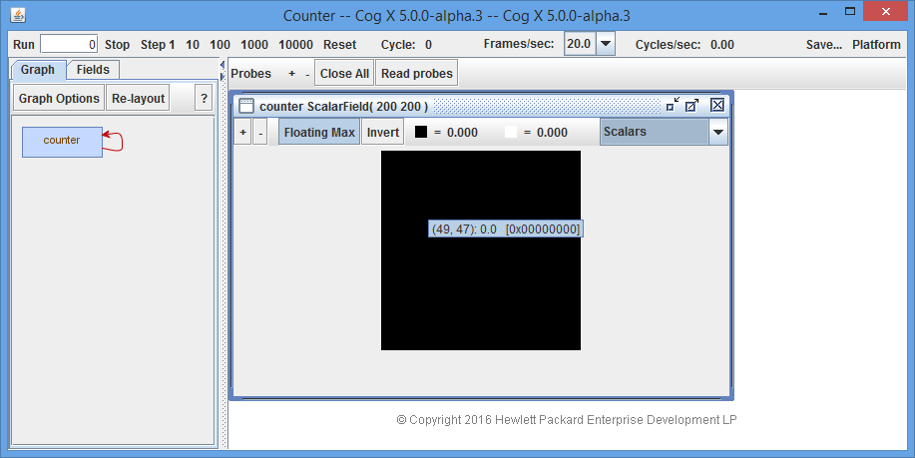

#Getting Started

The HPE Cognitive Computing Toolkit (CCT) is a GPU-accelerated platform for deep learning and other advanced analytics. The **cct-tutorial** contains a number of examples from each of the repositories that comprise the Cognitive Computing Toolkit. This guide along with the examples in this tutorial can be used to get an introduction to the platform.

*   [Intro](#intro)
*   [Abstractions](#abstractions)
    *    [Tensor Fields](#tensor-fields)
         *    [Sensors](#sensors)
         *    [Actuators](#actuators)
    *    [Operators](#operators)
    *    [Compute Graph](#compute-graph)
*   [Introductory Examples](#introductory-examples)
*   [Neural Network Toolkit](#neural-network-toolkit)
*   [Programming CCT Applications](#programming-cct-applications)
*   [Visual Debugger](#visual-debugger)
*   [Other Tidbits](#other-tidbits)

## Intro

The CCT platform is software platform for developing-massively parallel applications that execute on multi-core processors such as GPUs. CCT differs from most other parallel programming paradigms (such as MPI, actors, transactional memory) by exposing the parallelism implicitly in the programming model rather than through explicit mechanisms and data structures. The model contains no threads, locks, message queues, critical sections, or races. It is a deterministic, massively-parallel programming model. It is also a declarative dataflow programming model, meaning that a CCT application describes the structure of the computation, not sequential actions.

### Language

CCT is written in the Scala programming language which runs on the Java Virtual Machine (JVM).

### Libraries 

The hpe-cct platform consists of several libraries, each contained in separate github repositories. The **cct-tutorial** has dependencies on these libraries.

**cct-core** - This is the core library and API. It contains the compiler and runtime system necessary to optimize and distribute a CCT application. This package is currently imported as `libcog`. The cct-core library also contains the visual debugger, *cogdebugger*. 

**cct-io** - This library provides a set of objects which can be used for getting data into and out of a running CCT application using the field initialization, *sensor*, and *actuator* primatives that are part of the cct-core API.  For example, it has APIs to read an image file or movie file. This package is currently imported into some of the tutorial examples as `cogio`.

**cct-nn** - This library provides APIs to support deep learning and neural networks. This package is currently imported into some of the tutorial examples as `toolkit.neuralnetwork`.

**cct-sandbox** - This library contains unstable CCT libraries for applications including signal processing and computer vision.

**cogdebugger** - This is a UI Wrapper for debugging CCT applications. It allows developers to visualize the compute graph, inspect the fields, and step through the compute graph. The visual debugger is part of the cct-core library, but the package is imported separately as `cogdebugger`.

## Abstractions

The CCT programming model has three core abstractions: *tensor fields*, *operators*, and *compute graphs*.  

* A *tensor field* is a multidimensional array (field) of multidimensional arrays (tensors) of elements (e.g. 32-bit floating point numbers).  Fields are used for inputs, outputs, computations, and persistent state. 
* An *operator* combines one or more tensor fields to create a new tensor field. 
* A *compute graph* combines tensor fields and operators into a single, massively-parallel unit of computation. 
 
The compute graph is a state machine, which evolves in discrete time. A single tick, or "step" of the CCT clock sends the input data through the entire compute graph to its outputs. Persistent state, for learning and adaptation, is handled using *feedback*. The state of a field can be updated at each step and fed back into the compute graph at the next step, providing control loops and learning.

Using these simple abstractions, the CCT compiler optimizes the computation across operators and can distribute the work efficiently to scale from one CPU to clusters with millions of GPU cores.

### Tensor Fields

In CCT, fields (or *tensor fields*) are the primary data structures used for input and output data, computation, and persistent state. 
A *tensor field* is a multidimensional array of multidimensional arrays of numbers. A *tensor* is a multidimensional array. Thus, a *tensor field* is a multidimensional array of tensors. 

Types of fields:
* ScalarField
* VectorField
* MatrixField
* ComplexField       (a scalar field with complex elements)
* ComplexVectorField (a vector field with complex elements)
* ColorField         (a field where each order-1 tensor is a pixel)

Each field has a shape, a tensor shape, and an element type. The field shape has a dimension. The tensor shape also  has a dimension, called an order.  CCT supports up to 3 dimensions and up to 3rd-order tensors.  Shapes are defined by layers, rows, and columns. A field with 3 dimensions has layers, rows, and columns. A field with 2 dimensions has rows and columns. For tensors, an order-0 tensor is called a scalar and contains a single number. An order-1 tensor is called a vector and contains one or more numbers. An order-2 tensor is called a matrix. The 3rd-order tensor is just called `Tensor3` in CCT.  Tensors hold elements, which are defined by the `ElementType`, e.g. `Float32`. The complex fields have real and imaginary components, which are both floats. 

Additional field types may be defined by the user.

For example #1, `counter` is a `ScalarField`. Its field shape is `Shape(200 200)`, for 200 rows and 200 columns. Its `dimensions` is 2. The `tensorOrder` is 0.  

In the `BackgroundSubtraction` example, the `movie` field has the following:
* `movie.fieldShape = Shape(270 480)`
* `movie.fieldShape.dimensions = 2`
* `movie.tensorShape = Shape(3)`
* `movie.tensorShape.dimensions = 1`
* `movie.tensorOrder = 1` 
* `movie.elementType = Uint8Pixel`

This shows in the visual debugger as `ColorField( 720 480 )( 3 )`.

The `ColorField` is a special case of the `VectorField`. The VectorField version has an `elementType` of `Float32`.

The **cct-tutorial** directory `libcog/fields` contains some examples using different types of fields. `CombiningFields` shows the various legal combinations of different fields. 

#### Sensors

Sensors are inputs to *tensor fields* from external data streams, such as a video camera or a file, into a *compute graph*. The sensor can feed a frame from a video camera as a tensor field for computation within a compute graph. Other examples of external data streams are consoles, video displays, microphones, speakers, touch sensors, databases, and so on.  

In the `BackgroundSubtraction` example, the `ColorMovie` API from `cogio` feeds one frame into a *tensor field* for each step (or cycle) of the *compute graph*. Other examples in the `cogio` folder of the tutorial illustrate APIs for reading movie files (in color or grayscale), a variety of image file formats, a webcam, and binary files. 

The `libcog/sensors/ScalarSensorActuatorExample` in the tutorial illustrates how to implement a scalar sensor and actuator using
scala iterators and functions.

`val date = new Sensor(Shape(3), getTime)`

The `Sensor` constructor take a a parameterless function, which returns an `Option[Iterator[Float]]`. In this example, it is the `getTime` function.

`Sensor` parameters:
* fieldShape
* nextValue  - optional iterator, next field in row-major order, can return `None`.
* resetHook - reset to initial value, this can be empty.
* desiredFramesPerSecond (optional) - to throttle back the speed; for example, so that a movie is played at an appropriate speed.

Sensors can be pipelined or unpipelined. Pipelined sensors use the CPU to produce an input to the GPU while the GPU is working on the previous input. Pipelined sensors are the default. The class `UnpipelinedSensor` is used for unpipelined sensor, which does the work in series, first on the CPU, then the GPU at each step. And unlike the pipelined sensor, it must always return a nextValue. The **cct-core** library also contains sensor classes specifically for Vector and Color fields.

The **cct-nn** package also provides sensor APIs, such as `ByteDataSource`, used for reading binary files. There is also a `RandomSource` API, for generating random data. Several examples in the `toolkit/neuralnetwork/` directory use these APIs to read the MNIST training dataset and labels.

#### Actuators

Actuators are *tensor fields* that are output from a *compute graph*.  The *compute graph* sends out information or enacts side-effects through actuators, which are *tensor fields* that source external data streams such as consoles, video displays, speakers, databases, or files. Actuators are the complement of Sensors.

what can we say about actuators - pipelined/unpipelined, special case for Color and Vector, 
* @param op The actuator opcode for this field.
* @param source The scalar field driving this actuator.
* @param update A user-supplied callback function that is provided an iterator over the actuator's new data.
* @param resetHook An optional callback function that is called upon reset.

which tutorial examples are relevant here - `libcog/sensors/ScalarSensorActuatorExample` defines an actuator to do blah. `libcog/actuators/ActuatorExample`

### Operators

- built-in
- feedback operator
- user-defined GPU operators
- user-defined CPU operators

### Compute Graph

From above: The compute graph is a state machine, which evolves in discrete time. A single tick, or "step" of the CCT clock sends the input data through the entire compute graph to its outputs. Persistent state, for learning and adaptation, is handled using *feedback*. The state of a field can be updated at each step and fed back into the compute graph at the next step, providing control loops and learning.

The compute graph defines the inputs and outputs and all of the operations. can be embedded in and controlled by a conventional application.  It is the computation unit, all the operations performed on a frame, for example. 
 
## Introductory Examples

### Example #1
`Counter` is a very simple example. Here is the code:

    package tutorial.libcog.fields

    import cogdebugger._
    import libcog._
    
    object Counter extends CogDebuggerApp(
      new ComputeGraph {
        val counter = ScalarField(200, 200)
        counter <== counter + 1
      }
    )

It can also be found [here](https://github.com/hpe-cct/cct-tutorial/blob/master/src/main/scala/tutorial/libcog/fields/Counter.scala) and at this location  in your IDE: `./cct-tutorial/src/scala/tutorial/libcog/fields/Counter.scala`.

This program defines one field, `counter`, which is a 2-dimensional scalar field with 200 rows and 200 columns. It uses the feedback operator `<==` to increment itself by 1 with each clock tick or step.

This next figure shows `Counter` running in the visual debugger. 

The visual debugger is a graphical tool that allows you to step, reset, and "peek inside" a `ComputeGraph` to visualize the computation while it executes. Clicking on the blue box labeled "counter" in the left pane, opens the "counter" window in the right-pane (as shown here). The "counter" window on the right shows that the "counter" field is a ScalarField with a size of 200x200. Placing the cursor over a point in the field will momentarily bring up a tooltip displaying the coordinates and value at that point. In this case, value is "1.0" at the location (1,2) after stepping through the graph one time. 

The "Cycle" value at the top shows how many steps have been taken, which in this case is "1". All 40,000 points have a value of "1" after 1 cycle. 

The buttons in the top left allow you to control stepping through the graph. Clicking "Step 1" will add 1 to every point, which is 40,000 additions. Clicking "Run" with a "0" in the adjacent box, steps through the graph until "Stop" is clicked.  Clicking "Reset" resets the ComputeGraph fields back to their initial state.  

* Note to Julie: the above was submitted to the main with changes to the names of the pngs (changed to multiple paragraphs for debugger) - maybe switch up order? - get my version to match what was submitted

### Example #2

`BackgroundSubtraction` is a good example to illustrate several more concepts covered in this tutorial. Here is the code:

    package tutorial.cogio

    import cogdebugger.CogDebuggerApp
    import cogio._
    import libcog._

    object BackgroundSubtraction extends CogDebuggerApp (
      new ComputeGraph {
        val movieFile = "resources/courtyard.mp4"
        val movie = ColorMovie(movieFile, synchronous = false)
        val movieVector = vectorField(movie)
        val background = VectorField(movie.fieldShape, Shape(3))
        background <== 0.999f*background + 0.001f*movieVector
        val backgroundColor = colorField(background)
        val suspicious = reduceSum(abs(background - movieVector))
        probe(movie)
        probe(background)
        probe(suspicious)
      }
    )

It can be also found [here](https://github.com/hpe-cct/cct-tutorial/blob/master/src/main/scala/tutorial/cogio/BackgroundSubtraction.scala) and at this location in your IDE:
`./cct-tutorial/src/scala/tutorial/cogio/BackgroundSubtraction.scala`

The input is an mpeg movie file. The `ColorMovie` API from cct-io opens the file, creates a sensor, and feeds one frame into the sensor for each step of the compute graph. The `movie` field is `ColorField` of 2 dimensions, 270 rows by 480 columns with 3 pixels for the color. It is converted to a `VectorField` of the same shape. Most operations work on vector fields, not color fields.

The `VectorField` named `background`is created using the same shape, dimensions, and order as the `movieVector`, 270x480x3. The background is learned over time from the frames of the courtyard movie with the use of the feedback operator, `<==`.  It takes about 1000 frames to stabilize. The background pixels at each position outweigh any temporary movement in the foreground. This calculation involves two constant multiplications and one addition at each point.  

The value `backgroundColor` isn't used. It is here to demonstrate how to convert from `VectorField` to `ColorField`.

Then finally we can calculate the `suspicious` activity, which is any activity that isn't part of the background. The calculation  is to subtract the movieVector from the background, take the absolute value, then apply `reduceSum` to sum of the values at each point over the 3 color planes. If there is minimal difference, the point stays black. If there is a difference, the point shows white. After the background gets learned, the application identifies the people moving around the courtyard, even the fluttering of the leaves, from the background.

The last 3 lines use the `probe` API of the visual debugger. This is used to enable probing of these fields in the debugger.

## Neural Network Toolkit

* in each section point to good examples to look at 

## Programming CCT Applications

what can we plu here

## Visual Debugger

go over its functionality

## Other Tidbits

Debug Flags?

