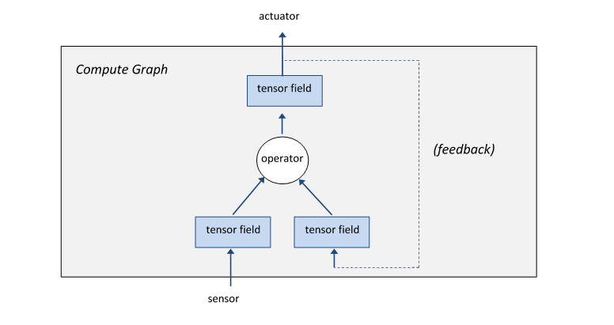

#Getting Started

The HPE Cognitive Computing Toolkit (CCT) is a GPU-accelerated platform for deep learning and other advanced analytics. The CCT-Tutorial contains a number of examples from each of the repositories that comprise the Cognitive Computing Toolkit. This guide can be used to get an introduction to the platform.

## Intro

The CCT platform is software platform for developing-massively parallel applications that execute on multi-core processors such as GPUs. CCT differs from most other parallel programming paradigms (such as MPI, actors, transactional memory) by exposing the parallelism implicitly in the programming model rather than through explicit mechanisms and data structures. The model contains no threads, locks, message queues, critical sections, or races. It is a deterministic, massively-parallel programming model. It is also a declarative dataflow programming model, meaning that a CCT application describes the structure of the computation, not sequential actions.

### Language

CCT is written in the Scala programming language which runs on the Java Virtual Machine (JVM).

### Libraries 

The cct-tutorial currently has the following library dependencies.

**cct-core** - This is the core library and API. It contains the compiler and runtime system necessary to optimize and distribute a CCT application. This package is currently imported as `libcog`. The cct-core library also contains the visual debugger, *cogdebugger*. 

**cct-io** - This library provides a set of objects which can be used for getting data into and out of a running CCT application using the field initialization, *sensor*, and *actuator* primatives that are part of the cct-core API.  For example, it has APIs to read an image file or movie file. This package is currently imported into some of the tutorial examples as `cogio`.

**cct-nn** - This library provides APIs to support deep learning and neural networks. This package is currently imported into some of the tutorial examples as `toolkit.neuralnetwork`.

**cct-sandbox** - This library contains unstable CCT libraries for applications including signal processing and computer vision.

**cogdebugger** - This is a UI Wrapper for debugging CCT applications. It allows developers to visualize the compute graph, inspect the fields, and step through the compute graph. The visual debugger is part of the cct-core library, but the package is imported separately as `cogdebugger`.

## Abstractions

The CCT programming model has three core abstractions: *tensor fields*, *operators*, and *compute graphs*.  

* A *tensor field* is a multidimensional array (field) of multidimensional arrays (tensors) of elements (e.g. 32-bit floating point numbers).  Fields are used for inputs, outputs, computations, and persistent state. 
* An *operator* combines one or more tensor fields to create a new tensor field. 
* A *compute graph* combines tensor fields and operators into a single, massively-parallel unit of computation. 
 
The compute graph is a state machine, which evolves in discrete time. A single tick, or "step" of the CCT clock sends the input data through the entire compute graph to its outputs. Persistent state, for learning and adaptation, is handled using *feedback*. The state of a field can be updated at each step and fed back into the compute graph at the next step, providing control loops and learning.

Using these simple abstractions, the CCT compiler optimizes the computation across operators and can distribute the work efficiently to scale from one CPU to clusters with millions of GPU cores.

## Introductory Examples

### Example #1
`Counter` is a very simple example. Here is the code:

    package tutorial.libcog.fields

    import libcog._
    import cogdebugger._Intro

    object Counter extends CogDebuggerApp(
      new ComputeGraph {
        val counter = ScalarField(200, 200)
        counter <== counter 
      }
    )

It can also be found [here](https://github.com/hpe-cct/cct-tutorial/blob/master/src/main/scala/tutorial/libcog/fields/Counter.scala) and at this location  in your IDE: `./cct-tutorial/src/scala/tutorial/libcog/fields/Counter.scala`.

This program defines one field, `counter`, which is a 2-dimensional scalar field with 200 rows and 200 columns. It then uses the feedback operator *<==* to increment itself by 1 with each clock tick or step.

This next figure shows `Counter` running in the visual debugger. add more details about the debugger here.

### Example #2

`BackgroundSubtraction` 
 is a relatively simple example to start with. It illusrtates several of the concepts covered in this tutorial.  It can be found [here](https://github.com/hpe-cct/cct-tutorial/blob/master/src/main/scala/tutorial/cogio/BackgroundSubtraction.scala) and under this path in your IDE:
`./cct-tutorial/src/scala/tutorial/cogio/BackgroundSubtraction.scala`

run inside cogdebugger - allows developer to visualize the graph, the fields, and step
wrapped in a compute graph
- input is mp4 file, each image or frame is size is 270x480, 3 bytes per pixel
- ColorMovieAPI from cct-io opens file and creates a sensor for feeding each frame into the compute graph  
- synchronous = false ? (look up what this does)
- vectorField (converts from ColorMovie data type to vectorField - most operations are supporte  
- background - initialized vectorField (same shape as the movie and sample depth (dimmension)
- background <== 0.999f*background + 0.001f*movieVector   
- operations - 2 x multiply by constant, or adds background and movieVector frame)
- <== feedback operator
- convert fromm vecotr field to color field
- caclulate suspicious 
- operations - subtract, absolute value, reduce sum
- intuition
- probe (part of cog debugger)
- run/stop/step/reset
- inspect - graph, fields, values

## Fields

what are the different types of fields

which tutorial examples are relevant here 

## Sensors

random, file sensor, user defined sensors

which tutorial examples are relevant here 

## Actuators

what can we say about actuators

which tutorial examples are relevant here 

## Operators

- built-in
- feedback operator
- user-defined GPU operators
- user-defined CPU operators

## The Compute Graph

The compute graph can be embedded in and controlled by a conventional application.  
 

## The Debugger

go over its functionality

## Programming CCT Applications

what can we plut here

## Neural Network Toolkit

* in each section point to good examples to look at 

