#Cog 4.1 Programming Tutorial

[//]: # ({width="8.35in" height="10.85in"})

[//]: # (Table of Content {#table-of-content .TOCHeading})
## Table of Contents

1. [Introduction](1-introduction)
    1.  [Language](#11-language)
    2.  [Libraries](#12-libraries)
    3.  [Versioning](#versioning)
2. [Abstractions](#abstractions)

[2.1 Tensor Fields 6](#tensor-fields)

[2.2 Operators 7](#operators)

[2.3 Compute Graphs 8](#compute-graphs)

[3. Introductory Examples 9](#introductory-examples)

[3.1 Hello, World 9](#hello-world)

[3.2 Operators 11](#operators-1)

[3.3 Sensors 13](#sensors)

[3.4 Actuators 14](#actuators)

[4. Operators 15](#operators-2)

[4.1 Arithmetic: + - \* / 15](#arithmetic--)

[4.2 Convolution 16](#convolution)

[4.3 Real unary operators 17](#real-unary-operators)

[4.4 Real binary operators 17](#real-binary-operators)

[4.5 Complex operators 18](#complex-operators)

[4.6 Stacking and Slicing 19](#stacking-and-slicing)

[4.7 Trimming and Expanding 21](#trimming-and-expanding)

[4.8 Shifting and Warping 22](#shifting-and-warping)

[4.9 Subfield and apply(Range) 23](#subfield-and-applyrange)

[4.10 Tensor Reductions 24](#tensor-reductions)

[4.11 Field Reductions 25](#field-reductions)

[4.12 WinnerTakeAll 25](#winnertakeall)

[4.13 Inner products 26](#inner-products)

[4.14 ProjectFrame, BackProjectFrame and ConvolveFilterAdjoint
26](#projectframe-backprojectframe-and-convolvefilteradjoint)

[4.15 User-defined operators 26](#user-defined-operators)

[4.16 GPUOperators 27](#gpuoperators)

[4.17 Further operator documentation
28](#further-operator-documentation)

[5. Programming Cog Applications 29](#programming-cog-applications)

[5.1 Feed-forward computation 29](#feed-forward-computation)

[5.2 Feedback for adaptation 31](#feedback-for-adaptation)

[5.3 Reset and step 32](#reset-and-step)

[5.4 Programming styles in Cog: Think functional
33](#programming-styles-in-cog-think-functional)

[6. Debugging 34](#debugging)

[6.1 Launching the Debugger 34](#launching-the-debugger)

[6.2 Probing Fields 35](#probing-fields)

[6.3 Controlling the Computation 35](#controlling-the-computation)

[6.4 Viewing Compute Graph Structure
36](#viewing-compute-graph-structure)

[6.5 Visualizing Field Contents 39](#visualizing-field-contents)

[6.6 Standard Field Visualizations 39](#standard-field-visualizations)

[6.6.1 Scalar Fields 40](#scalar-fields)

[6.6.2 Vector Fields 40](#vector-fields)

[6.6.3 Matrix Fields 40](#matrix-fields)

[Appendix A: Field Operator and Function API
41](#appendix-a-field-operator-and-function-api)

1. Introduction
===============

Cog ex Machina, or “Cog” for short, is a software platform for
developing autonomous, adaptive, massively-parallel applications that
execute on digital, multi-core processors, such as GPUs, distributed
across a local network. Its design is motivated by the need to process
vast amounts of “rich” media in real time. It is designed to scale to
millions of cores.

Cog differs from most other parallel programming paradigms (such as MPI,
actors, transactional memory) by exposing the parallelism implicitly in
the programming model rather than through explicit mechanisms and data
structures. The model contains no threads, locks, message queues,
critical sections, or races. It is a *deterministic*,
*massively-parallel* programming model. It is also a *declarative*
*dataflow* programming model, meaning that a Cog application describes
the structure of the computation, not sequential actions. Since learning
and adaptation (as opposed to hardwired feed-forward behavior) are prime
objectives of Cog, this is both unavoidable and desirable.

This manual is an informal tutorial about programming on Cog using a
series of simple examples, most of which can be obtained from the Cog
project’s *tutorial* Git repository. This manual also discusses the Cog
programming API at a high level, but then also includes the Scaladoc of
the complete API as an appendix. The companion document, *Cog System
Setup Guide*, explains how to install Cog on a single machine or
cluster.

1.1 Language
------------

Cog is written in the Scala programming language which runs on the Java
Virtual Machine (JVM).

1.2 Libraries
-------------

Cog is distributed as a set of Scala libraries, and is organized in
three components: the core library, a graphical debugger, and an I/O
library.

The core Cog library may be accessed with a single import statement:

> import libcog.\_

libcog implements the Cog API and contains the compiler and runtime
system necessary to optimize and distribute a Cog application.

The debugger is accessed by importing:

import cogdebugger.\_

cogdebugger provides a graphical debugger that is used for
single-stepping and probing the internals of a Cog application as it
runs.

The I/O library is accessed by importing:

import cogio.\_

cogio provides a set of objects useful for getting data into and out of
a running Cog app using the field initialization, sensor, and actuator
primitives that are part of the core Cog API.

1.3 Versioning
--------------

This document refers to Cog version 4.1.

2. Abstractions
===============

The Cog programming model has three core abstractions: *tensor fields*,
*operators*, and *compute graphs*. A *tensor field* is a
multi-dimensional array (field) of multidimensional arrays (tensors) of
elements (e.g. 32-bit floating point numbers). Fields are used to
represent inputs, outputs, computational intermediates, and persistent
state. An *operator* combines one or more tensor fields to create a new
tensor field; it performs the computation in an application and controls
data flow. A *compute graph* combines tensor fields and operators into a
single, massively-parallel unit of computation that may be embedded in,
and controlled by, a conventional application. Compute graphs are state
machines which evolve in discrete *time*, where a single tick of the Cog
clock is abstracted as the period during which data flows completely
from the inputs of a compute graph to its outputs. Persistent state (and
hence learning, adaptation, and iteration) is handled by using
*feedback*; that is, the state of a field at a given time can be fed
back onto itself or another field at the next Cog tick in order to
provide control loops and learning. Restricting the programming model to
these simple abstractions provides sufficient information for the Cog
compiler to optimize computation across operators and distribute
computation efficiently on systems that scale from one CPU to clusters
of millionsof GPU cores.

2.1 Tensor Fields
-----------------

The word *tensor* has different connotations in math, physics and
engineering, but we will use the simplest definition that appears to be
popular in machine learning: a multi-dimensional array of numbers.
Numbers may be real or complex; we will use the word *element* to refer
to a number in a tensor regardless of type. The number of dimensions of
a tensor’s array of numbers is called the tensor’s *order*. An order-0
tensor is called a scalar and contains a single number. An order-1
tensor is called a vector and contains one or more numbers. An order-2
tensor is called a matrix. Higher order tensors don’t have generally
agreed-upon names, so Cog calls these Tensor3, Tensor4, etc…, where the
numeric suffix specifies the order. Currently Tensor3 is the highest
order tensor supported in Cog, though this can easily be extended. Here
are some graphical examples, where each red dot denotes a number /
element:

A *tensor field* is a multidimensional array of tensors, with all
tensors in the field having exactly the same order and shape. A field
may have zero, one, two or three dimensions. A zero-dimensional field
holds a single tensor.

The following field types are supported by the Cog core, and additional
field types may be defined by the user:

Each tensor of a ScalarField has a single real tensor element, whereas
each tensor of a ComplexField has a single complex tensor element.
VectorFields and MatrixFields generally have multiple tensor elements
per tensor. The tensor elements of the real fields (the ScalarFields,
VectorFields and MatrixFields) are 32-bit floating point values
(“floats”), while the tensor elements of the complex fields
(ComplexField and ComplexVectorField) are complex numbers whose real and
imaginary components are also floats. A ColorField is actually a vector
field holding three low-precision (8-bit) integer values. A ColorField
vector, also called a pixel, holds three, 8-bit color channels (red,
green, blue).

2.2 Operators
-------------

An operator takes one or more tensor fields and computes a new tensor
field as a result. For example, the + operator can be used to combine
two real or complex tensor fields with the same shape and tensor order
into a new field with the same shape and order, where each tensor
element is the sum of the corresponding tensor elements in the operands:

Cog supports the usual arithmetic operators on real and complex fields
which operate on the corresponding tensor elements of the two input
fields:

Beyond these basic operators, Cog supplies a rich set of algebraic and
transcendental operators, in addition to a number of operators useful to
signal processing and cognitive models. The full set of operators is
described in Chapter 4 and the operator API is presented in Appendix A.

One important operator introduced by the Cog programming framework is
the feedback operator

which is used to evolve state within a computation. This is essential
for learning and adaptation.

2.3 Compute Graphs
------------------

Tensors fields and operators are combined to create a computation unit
called a *compute graph*:

The compute graph brings in information from the outside world into the
computation with *sensors*, which are tensor fields that are sourced by
external data streams such as video cameras, microphones, touch sensors,
databases, or files. The compute graph sends out information or enacts
side-effects through *actuators*, which are tensor fields that source
external data streams such as consoles, video displays, speakers,
databases, or files.

A single step of computation in the graph proceeds in two phases. In the
first phase, operators propagate field information bottom-up from
sensors to actuators, ignoring any feedback connections (shown as a
dashed line in the above figure). In the second phase, the feedback
information is used to change the state of each field receiving a
feedback connection, specified by the &lt;== operator. This is
essentially a state machine: each step of computation reads input data
(sensors) to produce new outputs (actuators) and updates its internal
state.

A user may create a compute graph and “step” its computation by
repeatedly calling a step method, and may reset its state to
user-specified initial value by calling a reset method.

3. Introductory Examples
========================

A ComputeGraph can be embedded within an application, but it is easier
to learn the programming model and develop apps by using the Cog
debugger, a graphical tool that allows you to step, reset, and “peek
inside” a ComputeGraph to visualize the computation while it executes.
We will primarily use the debugger along with some visual examples for
the purposes of exhibition in this guide, but keep in mind that the
debugger generally will not be used for app deployment and the Cog model
can be used for processing and interacting with arbitrary types of data.

3.1 Hello, World
----------------

Let’s start with a simple ComputeGraph that runs in the debugger:

The Cog debugger wraps the compute graph, emulating the embedding of the
graph in an application. Note that applications may create and control
multiple ComputeGraphs if desired, but ComputeGraphs may not be nested.
In the above code, the “import libcog.\_” statement provides your
program access to all Cog functionality. The “import cogdebugger.\_”
gives access to the Cog debugger.

This application contains a two-dimensional scalar field named
“counter.” If you compile and run the above application, you will see a
window that looks like this:

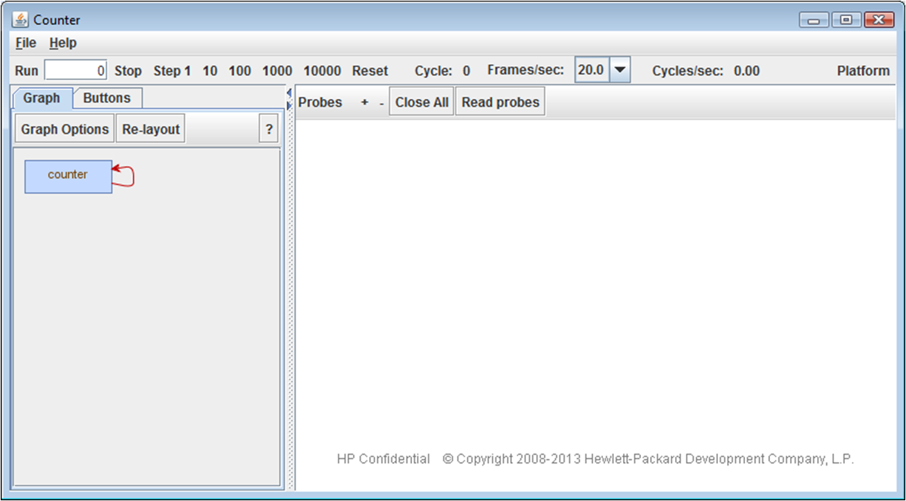
*image_caption*
{width="6.026336395450569in"
height="3.336965223097113in"}

The blue box in the upper left labeled “counter” is the graphical
representation of the field named “counter” in the code. The box label
text “counter” is taken from the variable name of the field in the code.
Clicking on the blue box will cause a window to open which displays the
current state of that field as a grayscale image:

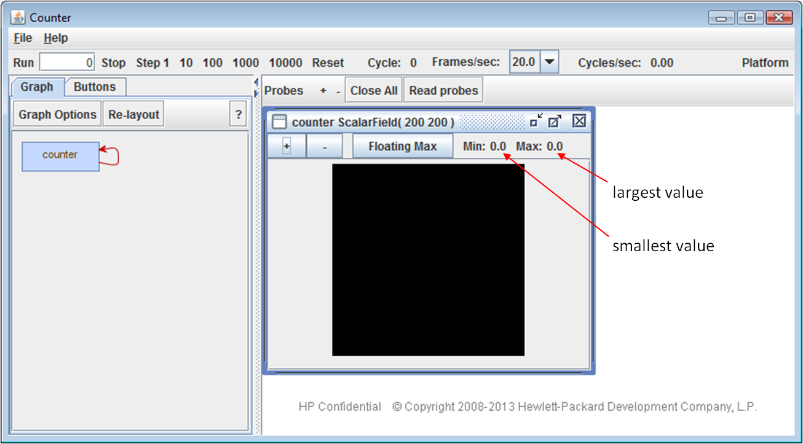{width="5.903695319335083in"
height="3.273584864391951in"}

The black box above is a 200 x 200 image, with each pixel displaying the
corresponding value of a real scalar within the dynamic field. The color
coding of values is shown, with the smallest value represented by black
and the largest by white. Since fields are initialized by default to all
zeros, this displays each scalar as a black pixel.

Clicking on the “step 1” button in the debugger will “clock” the field,
causing it to change its state by executing the line of code called the
“mutation operation”:

This statement says that the next state of the field, after the next
clock tick, is equal to the current state of the field with 1 added to
every point in the field. Since there are 40,000 points in the field,
this statement is describing 40,000 additions. Here’s what you’ll see in
the debugger after stepping once:

{width="5.9602985564304465in"
height="3.301887576552931in"}

Since every point in the field is now equal to one, the image
representing that field uses 40,000 white pixels to represent the field
state. Clicking “step 1” again will increment the points in the field so
that they each have the value 2. Placing the cursor over a point in a
field will momentarily bring up a tooltip describing the coordinates and
precise value at that point.

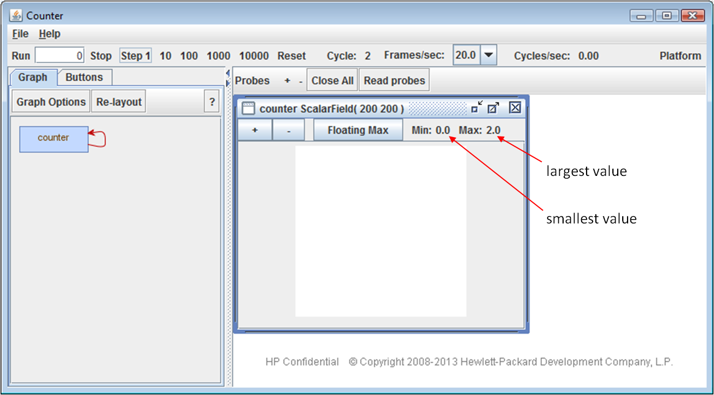{width="5.922563429571303in"
height="3.283018372703412in"}

3.2 Operators
-------------

Here’s a simple example of combining two fields to create a new one:

This example utilizes the IO Library which includes a number of useful
functions for getting data into a compute graph. In this example we use
the cogio object GrayscaleImage, a function object that initializes a
scalar field with data from an image file. In this example, two fields
named “grass” and “leaves”, which are necessarily the same size, are
averaged to create the field “average.” Here’s what you should see:

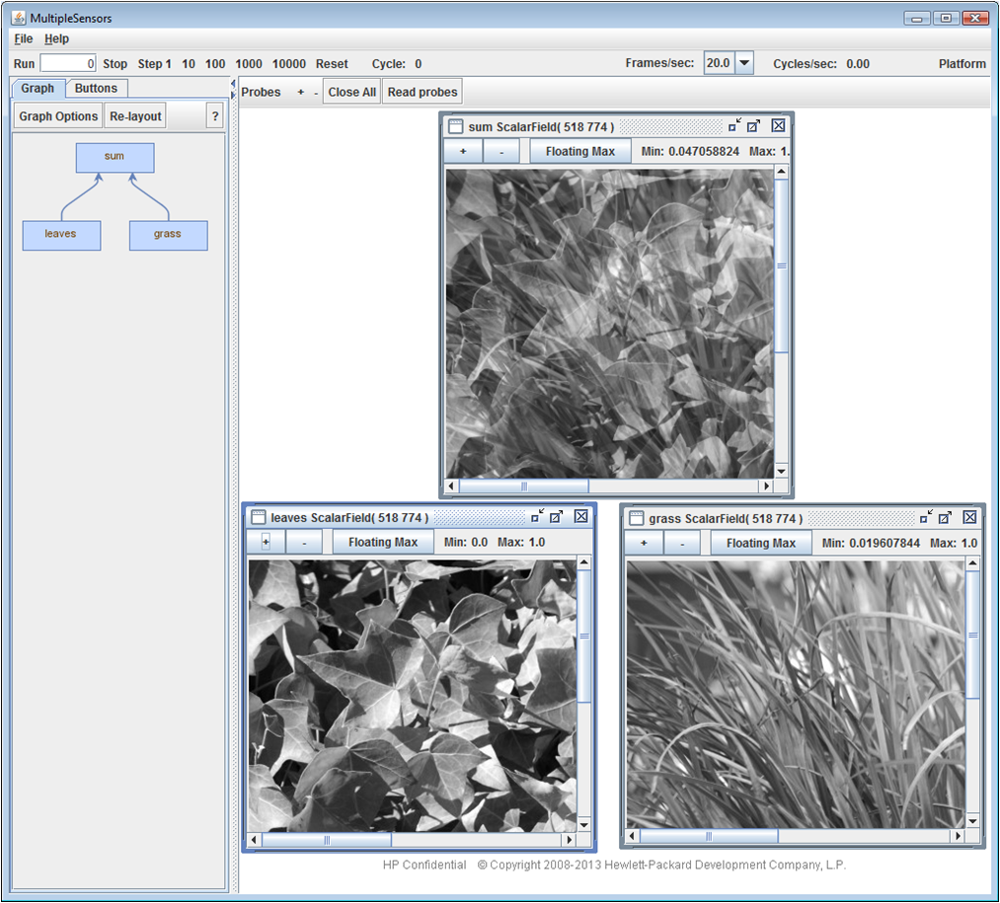{width="5.9602985564304465in"
height="5.386792432195976in"}

3.3 Sensors
-----------

Sensors pull in streams of data as a stream of fields, one for each Cog
tick. Here’s an example of reading in a movie file in a sensor:

Here we use the IO library function ColorMovie to create field from a
movie file. Since the movie will evolve over time, ColorMovie creates a
Cog Sensor which provides an interface for data flow from the outside
world into the compute graph at each Cog tick. Executing this example,
then clicking on the movie box followed by clicking Run will play the
movie within the debugger, displaying one frame per Cog tick.

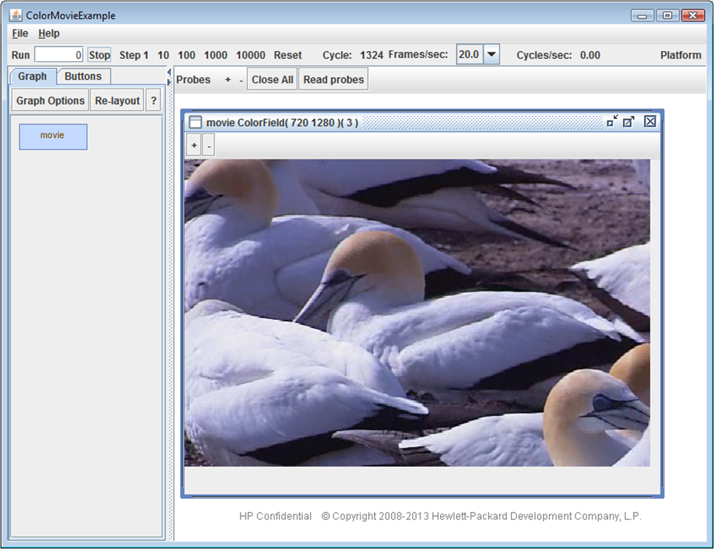{width="5.903695319335083in"
height="4.556604330708661in"}

3.4 Actuators
-------------

Actuators complement sensors; they are a mechanism for exporting data or
executing data-dependent side effects from within compute graphs. Here’s
a simple application which creates a one-dimensional scalar field with
simple feedback and prints it out each time the computation is stepped:

Note that since no special I/O is used we do not import cogio and since
we are just printing to the console we do not import cogdebugger. Since
we are not using the debugger here, we programmatically step the graph
each time we want to write output to the console. By importing graph.\_,
we can refer to various methods and fields of the compute graph simply.
The withRelease method ensures the release of the compute graph at the
end of the computation, which allows the runtime system to release the
CPU and GPU memory it has claimed and shut down gracefully. When
executed, this will print the following to the console:

Please consult section 5.1 “Feed-forward computation” for more insight
into Sensor and Actuator operation.

4. Operators
============

All field operations in Cog are expressed using operators, described in
this chapter.

4.1 Arithmetic: + - \* /
------------------------

Two dynamic fields may be combined arithmetically if: (1) both fields
have the same field shape, or at least one of the field shapes is
zero-dimensional; and (2) both fields have the same tensor shape, or at
least one of the tensor shapes is zero-dimensional (i.e. the field is a
ScalarField or ComplexField). The output field shape and tensor shape
are determined as described by the following pseudo-code:

One caveat is that the output must have the same field shape and tensor
shape as one of the inputs. Thus, the combination of a zero-dimensional
vector field and a multi-dimensional scalar field is not allowed as the
multi-dimensional vector field output is unlike either input. The input
that is unlike the output can appear as either the first or second
operand. If either input is a complex field, then the output will be
also.

Some examples:

Color fields are arithmetically incompatible with all other field types
since their element type (color pixel) is non-numeric. If you want to
perform operators on color fields you must first explicitly cast them as
vector fields by using colorField.toVectorField.

4.2 Convolution
---------------

Two-dimensional ScalarFields, ComplexFields, and VectorFields can be
convolved with a filter (expressed as a real or complex field). Here’s
an example of applying a Laplacian filter to differentiate an input:

This example details how you can initialize fields in Cog: you must
supply the shape and type of the field along with a function object
which defines how to initialize it. In this case we simply define a 2D
array by hand and then access that array in the constructor function.
After defining the filter we perform the convolution with the convolve
operator. Note that the convolve operator requires a BorderPolicy, which
defines how the border is handled during convolution. Here’s what you’ll
see when you execute this program:

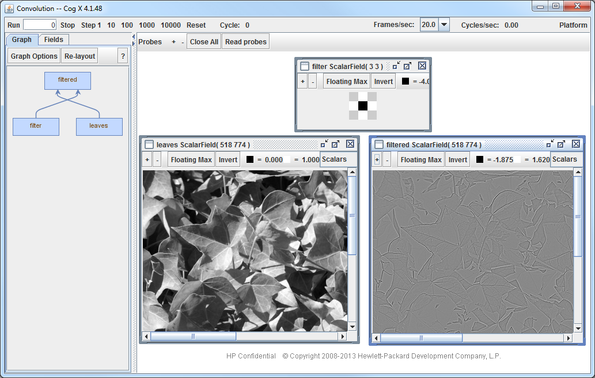{width="6.405555555555556in"
height="3.9791666666666665in"}

4.3 Real unary operators
------------------------

All real dynamic fields (scalar, vector and matrix) may have the
following operators applied to each numeric component of each tensor in
the field. The result is a field with the same type and shape as the
input.

The following operators take a real dynamic field and constant scalar as
operands and compute a result by applying the operator to each tensor
element independently. Since these operations involve only one field
operand, they are listed here as unary operators:

The constant operand supplied in the user’s code must be a Float or an
Int. While the pow operator accepts both integer and floating point
constants, all other operators will effectively convert an Int operand
to a Float before the operation proceeds. Double (i.e. 64-bit floating
point) constants are not accepted syntactically- use toFloat() or append
an ‘f’ as in 0.0f. The operators that test for equality and inequality
include three ‘=’ characters to avoid confusion with their Scala
counterparts ‘==’ and ‘!=’.

4.4 Real binary operators
-------------------------

The following binary operators take two real fields (scalar, vector or
matrix) with the same shape and produce a result of the same shape with
elements created by applying the binary operator to corresponding
elements in the two input fields:

As discussed in section 4.1, these operators also work if one of the
operands has a 0D field shape and/or 0D tensor shape. In these cases,
the data of these degenerate inputs is conceptually replicated along the
missing field shape or tensor shape dimensions.

4.5 Complex operators
---------------------

Complex fields are particularly useful for processing in the frequency
domain. Many algorithms involve correlations across a field; those can
often be performed much more efficiently by transforming the algorithm
between the space and frequency domains using the fast Fourier
transform. The standard complex binary arithmetic operators (+, -, \*,
/) are supported for complex fields as are the following unary
operators:

While the above complex unary operators produce complex fields, the
following additional operators produce real fields:

Here’s a screenshot of a complex field application, BoundaryCompletion
(in the tutorial.toolkit.filtering package), that solves the problem of
“filling-in” broken straight and curved line segments, a necessary step
for recognizing partially occluded objects. This application uses a
number of tricks, including data compression, steerable theory, and
frequency domain convolution, to enable real-time completion of
boundaries:

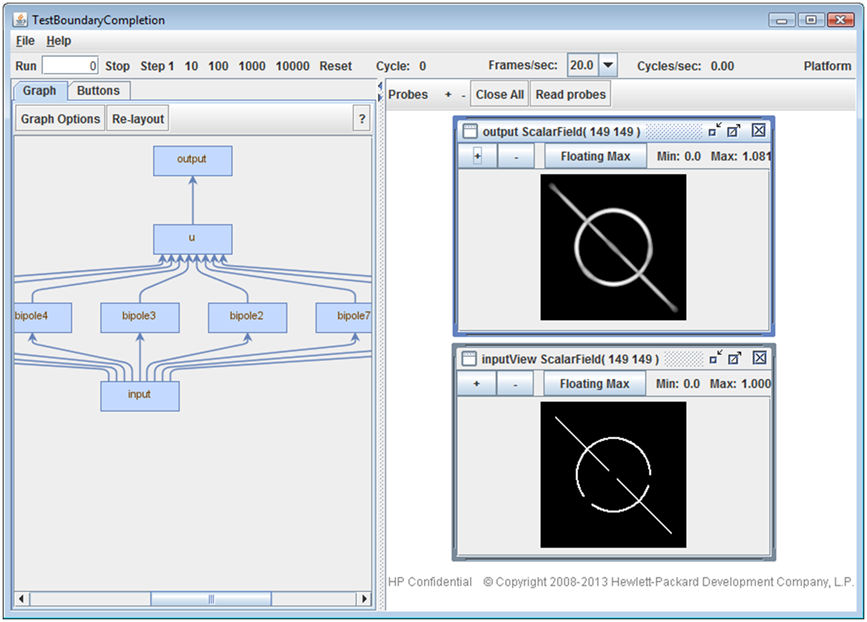{width="6.0in" height="4.263888888888889in"}

4.6 Stacking and Slicing
------------------------

In addition to the transformations already discussed, such as algebraic
combinations or convolution, it’s sometimes necessary to merge or break
apart tensor fields. Combining two or more fields is called *stacking*;
extracting a portion of a field is called *slicing*.

Stacking takes two or more fields, each with exactly the same field and
tensor shapes, and combines them into a higher dimensional tensor field.
Here’s an example of combining three 2-dimensional scalar fields into a
single 3-dimensional scalar field:

Notice that the resulting stacked field has a one-higher dimension than
the component fields that comprise it. This new dimension is indexed
first.

Stacking also works with higher-order fields, such as vector fields or
matrix fields. Here’s an example of stacking vector fields:

The stack operators shown so far increase the dimension of the component
fields. It’s also possible to stack fields in a way that preserves the
field dimensionality but increases the order of the tensors in the
resulting field. For example, you might want to stack three scalar
fields into a vector field. The operator for stacking fields at the
“tensor level” rather than the “field level” is named after the
resulting field type. Here’s an example stacking 3 scalar fields into a
vector field:

These “tensor stacking” operators also require that all input fields
have exactly the same field and lattice tensor, just like the stack
operator.

In a very similar manner, you can also stack vector fields into a matrix
field. The number of rows in each matrix is equal to the number of
scalar fields that are being stacked; the number of columns is equal to
the length of the vectors in the input vector fields. Here’s an example
of stacking vector fields to a matrix field:

The inverse of stacking is “slicing,” and there are both field and
tensor variants of it as well. Field slicing takes an N dimensional
field and extracts an N-1 dimensional field indexed along the first
dimension. The field slicing operator is the Scala “apply” operator.
Here’s an example of slicing a 2-dimensional scalar field to extract
1-dimensional fields:

You may slice higher-order fields (vector fields, matrix fields) as
well.

Slicing at the “tensor level” rather than the “field level” may be done
using the lattice slicing operators, vectorElement(index) or
matrixRow(index). These operators return a field with the same field
shape as the input, but the order of the tensors in that returned field
is one less than in the input field. For example, a matrix field can be
sliced to a vector field:

Similarly a vector field can be sliced to form a scalar field:

4.7 Trimming and Expanding
--------------------------

The trim operator reduces the field size of a field by discarding an
unneeded border region. Conversely, the expand operator increases the
field size of a field while supplying additional border elements per the
specified “borderPolicy” argument.

Here’s a simple example using trim and expand:

The supported border policies available with expand are BorderZero,
BorderClamp and BorderCyclic. The BorderZero policy supplies 0.0f for
the additional border elements as shown in the previous example. With
the BorderClamp policy, the border values along all four input edges are
copied into the expanded output field, wrapping around as though the
output field were a torus. This is useful when doing convolution with
the FFT and one wishes to minimize border effects by "border clamping".
And finally with the BorderCyclic policy, the supplied border values are
taken from a cyclic “wrap-around” view of the input. This policy is
useful when expanding a field size to make it a power of 2 in each
dimension prior to performing a cyclic convolution using the FFT.
Further numeric examples of expand with the various border policies are
given in the Scaladoc.

4.8 Shifting and Warping
------------------------

The expand and trim operators just presented alter a field’s shape while
preserving the data origin. Conversely, the shift and warp operators
move the origin of the data while preserving the field shape.

Here’s a simple example using shift:

Note that positive shift amounts shift the input down and to the right,
while negative shift amounts shift the input up and to the left.

The warp operator introduces the added power of dynamic and non-integral
shift amounts. In its simplest form, the warp operator inputs a
0-dimensional “guide” field whose tensor dimension is equal to the field
dimension of the field to be shifted. The warp operator performs a
bilinear interpolation of field points in response to non-integral shift
amounts specified by the guide vector. Here’s an example of the use of
warp:

The above example shows how warp can be used to perform a uniform shift
of an input field. In truth, the guide field can have a field shape
equal to the output field shape, and thereby provide a unique shift
amount for each output field point. The guide field is used by each
output point to determine which input point it is equal to (this
“output-centric” approach guarantees that each output point is
specified).

Finally note that the border policies associated with expand, namely
BorderZero, BorderClamp and BorderCyclic, are supported.

4.9 Subfield and apply(Range)
-----------------------------

While the shift operator performs only shifting, and the trim operator
performs only trimming, there are additional operators that allow you to
perform both functions at the same time.

If you wish to extract a “window” or “subfield” of a field’s data and
know the size and origin or that window at model compile time, then you
can extract this subfield using the “apply(Range)” operator:

However, if the origin of the subfield can only be dynamically
determined (i.e. comes from a field), then you can use the subfield
operator:

Finally note that the border policies associated with warp, namely
BorderZero, BorderClamp and BorderCyclic, are supported by subfield, as
is the bilinear interpolation of elements for non-integral guide values.

4.10 Tensor Reductions
----------------------

Tensor reduction operators allow you to take a field with tensors of
order 1 or more, and map it to a scalar field (with tensors of order 0).
In other words, they let you collapse a VectorField or MatrixField (or a
higher order field) to a ScalarField.

As an example, consider the problem of normalizing a vector field such
that each vector in the field is normalized with either an L1 norm (the
vector components sum to 1) or an L2 norm (the squares of the vector
components sum to 1). Here’s how you can do this:

The reduceSum operator maps each vector in the field to the sum of its
component, which is a scalar. So the expressions in the above examples
are each dividing a vector field by a scalar field, producing a
(normalized) vector field as a result.

Here’s an example of using this technique to approximate the max
function using the L10 norm:

There are two other tensor reduction operators, reduceMin and reduceMax,
which map each vector in the field to a scalar corresponding to the
smallest or largest component of the vector, respectively. Here’s an
example of using reduceMax to compute a “winner-take-all” version of a
vector field, where each vector has its largest component set to 1 and
the rest set to 0:

A final class of tensor reduction operators, designed to be useful in
processing image and filter frames, take an additional integer “factor”
argument and perform “block” tensor reductions. The block tensor
reduction operators are:

The following example shows a block reduction:

4.11 Field Reductions
---------------------

Field reduction operators allow you to take a multi-dimensional field
and reduce it down to a zero dimensional field (with tensors of the same
order). The field reduction operators are:

For example, if one had a two-dimensional scalar field with positive
values that you wanted to bring into the range \[0,1\], one could write:

When the field reduction operators are applied to vector and matrix
fields, they operate on each set of like-indexed tensor elements
separately. For example, fieldReduceMax operating on a vector field of
vector-length 3 would produce a single length-3 vector as its output.
Each of the elements in the vector would be the maximum of the
like-indexed “plane” of the input vector field.

Another field reduction operator, maxPosition is similar to
winnerTakeAll. However, maxPosition is restricted to operate on scalar
fields and returns the coordinates of the position holding the field’s
maximum value (rather than the value itself). These coordinates are
returned as a zero dimensional vector field of length equal to the field
dimensionality of the input.

4.12 WinnerTakeAll
------------------

The winnerTakeAll operator identifies the maximum value in the field
with a 1.0f value, with all other values being set to 0.0f. Should there
be multiple field points with the same maximum, the lowest indexed field
point (counting first along columns, then rows, then layers) is marked
the winner.

When winnerTakeAll is applied to vector and matrix fields, it operates
on each set of like-indexed tensor elements separately. For example,
winnerTakeAll operating on a vector field of vector-length 3 would
produce three 1.0f values, each having a different element index within
its tensor (though not necessarily in the same tensor).

4.13 Inner products
-------------------

Inner products of two fields are performed by taking dot products of
corresponding tensors within the fields:

4.14 ProjectFrame, BackProjectFrame and ConvolveFilterAdjoint
-------------------------------------------------------------

To be written.

4.15 User-defined operators
---------------------------

Field operations are compiled to execute on GPUs or other multicore
compute resources. However, you might occasionally need an operator that
cannot be expressed as a composition of the existing operators. In those
cases you can write a custom operator. Although this gives great
flexibility in using irregular operations, custom operators can be a
performance bottleneck since they may not parallelize well on a CPU.

Here’s an example of a custom operator, “upsideDown,” that takes a 2D
scalar field and flips it upside down. Here’s a program that uses the
operator:

Which produces the following result:

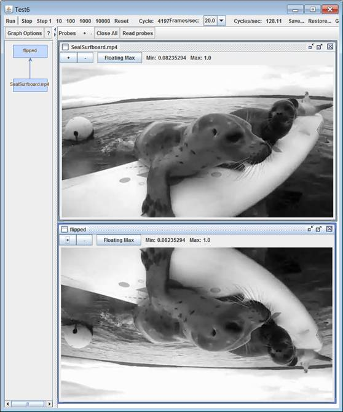{width="3.4791666666666665in"
height="4.181395450568679in"}

The custom operator is implemented as follows:

Because of the potential performance bottleneck of these user-defined
operators, their use is discouraged in favor of the more powerful
GPUOperator facility described next.

4.16 GPUOperators
-----------------

GPUOperators deliver the power of GPU’s to user-defined operations. This
facility is recommended for the more advanced modeler who has some
familiarity with GPU hardware architecture and performance issues. Keep
in mind that when a user’s needs can be met through a composition of the
existing Cog operators, it’s best to let the Cog compiler create
optimized kernels for the GPU based on that description.

Because of the intricacies of writing GPUOperators, their use is
described in a separate document *User-defined GPU Operators on Cog X*.

4.17 Further operator documentation
-----------------------------------

The operators described thus far are some of the most important ones
available within the Cog programming framework. However, a fair number
of additional Cog operators exist that are perhaps used less often or
only within certain modeling domains. Please see appendix A for
documentation of all Cog operators.

5. Programming Cog Applications
===============================

Although we’ve discussed tensor fields and the operators that can
combine them into new tensor fields, we’ve not yet shown how use them to
construct an application. This chapter explores how to program Cog,
starting with simple feed-forward computation then moving to computation
with feedback for implementing applications that need to adapt and
learn.

5.1 Feed-forward computation
----------------------------

The following figure shows the high level model for feed-forward
computation. External data is brought in to the computation through
sensors, transformed by field computations, then written back out
through actuators.

Each sensor or actuator contains two buffers, called the master and
slave, and behaves much like a master-slave flip-flop. Computation uses
a 2-phase clocking model, where each computational step consists of a
phase 1 clock followed by a phase 2 clock.

Thus a more detailed view of the computation looks like this:

When the ComputeGraph is reset, each sensor fills its master buffer with
initial data. It then executes a single computational step to “prime”
the computational pipeline.

A computational step involves a two phase protocol:

> In *phase 1* of a clock cycle, each slave buffer logically fills
> itself with a copy of the field data from its associated master
> buffer. This frees up all master buffers and immediately allows the
> following to proceed in parallel:

1.  Sensors fill their master buffers with new data from their external
    source (such as a video stream).

2.  The field data in the input slaves flows up through the field
    computation to the inputs of the actuator master buffers.

3.  Actuators write their slave buffers out to an external sink (such as
    a video display).

> In *phase 2* of a clock cycle, each master buffer latches its input
> data. For a sensor, the master input data is supplied by an external
> source such as a video camera, microphone, or file; data. For an
> actuator, the master input data is supplied by the field computation.
> The actuator slave data present initially upon reset can be supplied
> by an optional argument to the Actuator’s constructor, but is by
> default 0.

This 2-phase clocking complicates the computational model a bit, but
this is compensated by greater parallelism: while field computation
proceeds, the sensors can be concurrently loading in input data to their
master buffers, and actuators can be concurrently reading out data from
their slave buffers. Note that this implies a delay of one computational
step or cycle between the input to a sensor and the output of an
actuator.

Field computation is conceptually done in a data-flow style and involves
no clocking. In the following figure, the + operator adds inputs from
Sensor A and Sensor B as soon as they become available at beginning of
phase 1. The convolve operator depends on the result of the + operator,
so it waits for that to complete, then performs the convolution of that
sum with the data from Sensor C.

Here’s a Cog program that implements the computation shown in the
previous figure:

5.2 Feedback for adaptation
---------------------------

Field computation is necessarily feed-forward; it is not possible to
express feedback loops there (the Cog compiler will complain if you try
to do something like x = x + 1). However learning and adaption requires
feedback. This is accomplished with the &lt;== operator which can be
used to change the value of a “constant” field input at the end of each
cycle. A “constant” field which its value changed each cycle by the
&lt;== operator is called a *recurrence*.

Constant fields and recurrences alter the feed-forward compute model
only slightly:

Constant fields and recurrences are treated as inputs to the field
computation just like sensors. Recurrences are initially declared as
constants and then “mutated” into recurrences using the &lt;== operator:

The change of x’s value, though, is not immediate but delayed until the
following cycle. This is because recurrences have the same master/slave
buffer structure as sensors and actuators:

During field computation, the *slave* buffer provides the field data
used by the computation (this slave field data is the result of the
computation during the previous step). But the next state for the
recurrence value (x + 1 in the above example) is driven to the *master*
buffer, and is thus not visible until the next compute cycle. This
eliminates possible race conditions that could otherwise occur and also
prevents cyclic computations that could (at least in principle)
oscillate forever.

5.3 Reset and step
------------------

Resetting a ComputeGraph initializes all fields in the computation in
the following steps:

1.  The slave registers of all inputs are initialized with
    user-defined values. Constant fields are given their declared value;
    sensors have attached user functions which are queried for their
    field value; recurrences are initialized to the value given them
    when they were initially declared as constants.

2.  The input slave registers then flow through field computation to the
    inputs of the actuator master buffers.

3.  Finally the master buffers latch their inputs from the
    field computation.

When reset has completed, all input slave buffers, fields in the field
computation, and master buffers in actuators hold valid field data. Each
step thereafter then performs phase 1 clocking (copying all masters to
their slaves) followed by phase 2 clocking (filling master buffers with
their inputs).

5.4 Programming styles in Cog: Think functional 
------------------------------------------------

Although there are many styles in which a Cog application could be
programmed, a functional style is probably the easiest. The functional
paradigm considers an entire application to be nothing more than a
stateless function that transforms a set of inputs to a set of outputs
during a single Cog tick. The inputs are constants, sensors and
recurrences fed back from the previous tick. From a functional point of
view, these cannot be distinguished. The function consists of the field
computation, which is stateless and propagates completely during the
single tick. The sensors and the &lt;== operator, then, are nothing more
than mechanisms for supplying the function with a new set of inputs
during the next tick. Two things to keep in mind as you program are the
following:

(1) Make a concerted effort to not use feedback unless you need to
    preserve some state through a Cog tick.

(2) Explicitly and conceptually divide the computation into two
    sequential parts: 1) a feed-forward pass of the model
    computation, 2) an update phase in which all feedback/recurrent
    variables are computed

6. Debugging
============

Debugging is an important part of any application development process.
This chapter describes the CogDebugger tool in greater detail than
previous chapters and provides suggestions for identifying and
correcting errors in Cog programs.

The Cog Ex Machina platform includes a visual debugging tool intended to
help find and correct errors in applications developed on the platform.
In many cases, the contents of a field are difficult to interpret in a
raw numerical form, but can be visualized in a way that provides more
insight into why an application is not working (or why it *is* working).

The debugger’s graphical interface consists of three major parts. The
first is a set of controls for regulating the execution of a compute
graph. The second is a visualization of the compute graph’s structure.
The third is a ‘probe desktop’ where visualizations of a model’s various
fields can be displayed. These individual parts are more thoroughly
described later in this chapter.

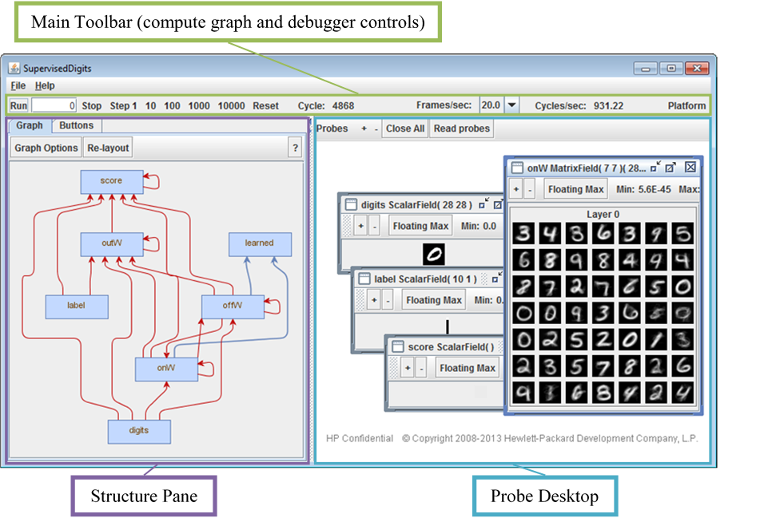{width="6.0in" height="4.277777777777778in"}

6.1 Launching the Debugger
--------------------------

The CogDebugger class defines the actual graphical user interface of the
debugging tool. It allows users to start, stop, step, and reset a
compute graph while visualizing its structure and the contents of its
fields. The simplest way to launch the GUI is to extend the
CogDebuggerApp class, which wraps a ComputeGraph instance and provides a
runnable main method that launches an instance of the visual debugger.

CogDebuggerApp and its related classes are members of the cogdebugger
package. Note that you must define an *object* (not a class!) that
extends CogDebuggerApp for the application to actually be executable, as
shown below.

The above example defines a simple application, MultiplierDebugger, that
can be launched from the command line or your IDE. If you launch this
app as is however, you will notice that the ‘multiplied’ field is
unaccounted for in the debugger. This is due to the Cog platform
compiler’s optimizer. The next section describes how to prevent the
compiler from eliminating a field of interest.

6.2 Probing Fields
------------------

By default, the Cog compiler aggressively optimizes a compute graph to
maximize its execution performance. In some cases, fields and
expressions defined in a compute graph can be merged together or
eliminated entirely by the optimizer, and are thus unavailable to the
debugger. In the previous example, the field ‘multiplied’ is not used in
any other expression and is seen as ‘dead code’ by the compiler and
consequently removed. To prevent the compiler from optimizing away a
field of interest, we must explicitly state in our program that we would
like to ‘probe’ the field in the debugger,by calling the probe method
(defined on all fields), as shown below.

The previous example has been modified to ensure that the ‘multiplied’
field appears in the debugger. Alternatively, ComputeGraph also defines
a probeAll method that essentially disables the optimizer. This causes
the computation to execute more slowly, but every field will be
available for inspection in the debugger. Note that sensors and
actuators are never eliminated by the compiler and do not need to be
explicitly probed. Lastly, also be aware that a field’s probe method
accepts an optional user-defined String to use as the field’s name in
the debugger, though the default name, derived from the val or var to
which the field is assigned, usually suffices.

6.3 Controlling the Computation
-------------------------------

The main toolbar across the top of the debugger window serves as home to
all the controls for starting, stopping, and resetting the computation,
as well as a control for the maximum rate at which field visualizations
update. It also displays the current cycle of a running computation and
the rate at which it is advancing. An example of the toolbar (taken from
a running app) is shown below.

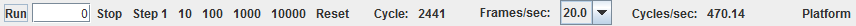{width="6.0in" height="0.1840277777777778in"}

In order of their appearance on the toolbar (left to right), the
provided controls and displays are:

1.  **Run** – Steps the compute graph continuously and as fast
    as possible. The running computation can be interrupted by pressing
    **Stop**, or be made to end after achieving a certain cycle count by
    setting the **Cycle Count Box** to a number other than zero.

2.  **Step Count Box** – Controls how many steps will be executed by
    pressing the **Run** button. If set to 0, the model will execute
    until **Stop** is pressed. If a number is entered, pressing **Run**
    will only execute that many steps before stopping.

3.  **Stop** – Stops a running computation, regardless of how it was
    started or if it had queued steps remaining.

4.  **Stepping controls** – Steps the computation a fixed number of
    times (in powers of ten from 0 to 4). These buttons are provided for
    convenience, as the same can be achieved through use of the **Step
    Count Box** and **Run** button. These buttons can be pressed again
    while the computation is executing to enqueue additional steps (e.g.
    double-clicking ‘1000’ will cause the model to execute for
    two-thousand cycles before pausing). These buttons have no effect if
    the computation is executing as a result of pressing the
    **Run** button.

5.  **Reset** – Resets the current computation to its initial state (at
    step zero). Any currently executing computation is first stopped.

6.  **Cycle Counter** – Displays the current step of the computation.

7.  **Frames/sec Dropdown** – Controls the maximum rate at which field
    visualizations will update and redraw themselves.

8.  **Cycles/sec Counter** – Displays the rate at which the computation
    is executing (in Hertz)

9.  **Platform** – Prints information to the console about the OpenCL
    platform detected in the system and any installed GPUs.

6.4 Viewing Compute Graph Structure
-----------------------------------

The left panel of the debugger window is dedicated to visualizations of
a ComputeGraph’s structure. Using the tabs at the top of the panel, you
can choose among the different visualizations, which may show or more
less detail or simply present the graph structure in different ways.
These visualizations also provide the means for launching the
visualizations of individual fields in a compute graph, which are
covered in section 7.1.4.

The default visualization for a compute graph’s structure is the Graph
View. The compute graph is displayed as directed node graph, with each
field in the computation presented as a vertex (labeled according to the
field name), and each edge indicating data flows between fields. Blue
edges represent the feed-forward data flow of the computation – that is,
clock phase 1 (see section 5.1). Red edges are feedback edges; data is
passed along them in clock phase 2 (section 5.2). Note that a ‘step’ in
the debugger consists of both clock phases.

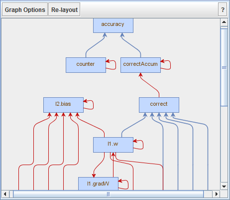{width="4.815972222222222in"
height="4.175694444444445in"}

Any vertex in the graph can be clicked to launch the default
visualization for the associated field. The visualization appears on the
Probe Desktop (see section 7.1.4). If multiple visualizations exist for
a particular field, right-clicking the field will pop-up a context menu
with the alternatives. Note that clicking (left or right) a field for
which a visualization is already open on the desktop will bring that
visualization to the foreground, rather than open a new visualization.

Depending on the complexity of your application, the basic graph can get
very large and cumbersome. To cut down on the number of displayed
vertices and edges, the graph view can optionally group fields into
*modules*. A module is just some object with references, direct or
indirect, to fields and other modules. Those fields and modules directly
accessible from a given module are said to be children of or contained
in that module. Thus, a module hierarchy is implicit in the definition
of any ComputeGraph, with the class extending ComputeGraph serving as
the root or top-level module. Consider the following example Cog
program:

Four scalar fields exist in this compute graph implementation. One in
the ModuleExample instance, one in an instance of Foo, and one in each
of two instances of Bar. From the perspective of the ModuleExample
instance, each of these fields can be accessed by a different chain of
references, e.g. ‘scalarField’ refers to a different field than does
‘foo.bar.scalarField’. Only the first scalarField is directly accessible
from the ModuleExample instance, the others are only accessible through
a Foo and Bar object. Thus, the ModuleExample instance defines a single
module containing one field and two sub-modules.

To see the modules into which a compute graph can be divided, click the
**Graph Options** button in the graph view’s toolbar, and then select
**Show Modules**.

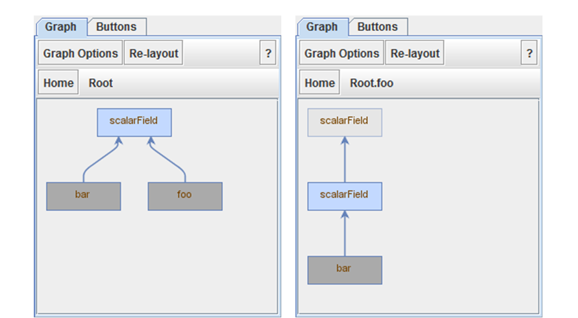{width="2.7916666666666665in"
height="3.404861111111111in"}
{width="2.7916666666666665in"
height="3.404861111111111in"}

In this mode, the view is focused on a single module at a time,
indicated on the secondary toolbar (that only displays in this mode).
The child fields of the currently focused module are displayed as blue
vertices and child modules as dark grey. Edges that go to or originate
from fields outside the focused module are not left dangling, but
connect to ghosted, light grey vertices labeled with the full path of
the field. Clicking on a field vertex launches a visualization as
before, but clicking a module selects that one as the new focus and
redraws the graph from the perspective of that module. Clicking one of
the ghosted vertices corresponding to an outside field focuses that
field’s parent module. In this way, you can navigate the module
hierarchy to find any fields of interest for probing. You can navigate
back to the root module at any time by clicking the **Home** button on
the secondary toolbar.

Lastly, if you’re not interested in the structure of the compute graph
but simply want to launch a visualization for a particular field, the
Buttons View dispenses with edges entirely. Simply select the
**Buttons** tab to be presented with a collection of buttons, one per
field in the model, labeled by the corresponding field name and sorted
in alphabetic order. As with field vertices in the graph view,
left-clicking a button opens the default visualization for the
corresponding field, while right-clicking presents all available
options.

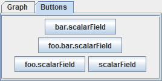{width="2.7909722222222224in" height="1.4in"}

6.5 Visualizing Field Contents
------------------------------

The last pane of the debugger is the Probe Desktop. This is where the
visualizations for fields will appear when a field vertex or button is
clicked in the structure pane. Each visualization opens in its own
window that can be moved, resized, minimized, and maximized, and that
has its own toolbar to adjust and control the visualization. While most
visualizations can be zoomed by using the **+** and **–** buttons on the
toolbar, they do not automatically adjust zoom level as the size of
their window changes.

In order to update the visualizations, any ongoing computation must be
briefly paused to ensure data consistency and that all the data that
produced a visual came from the same cycle of the computation. As a
result, opening many visualizations simultaneously can impact the
performance of a running app. The maximum rate at which visualizations
will update and rerender can be controlled by the **Frames/sec**
dropdown on the main toolbar. Note that some visualizations are
computationally expensive to render and may not achieve this target
update rate. You can request that all visualizations update and rerender
at any time by clicking the **Read Probes** button on the desktop’s
toolbar.

6.6 Standard Field Visualizations
---------------------------------

The aim of this section is to familiarize you with the standard
visualizations that are part of the Cog Debugger tool. Depending on the
type and shape of a field, different visualizations are available. For
example, a field consisting of two-dimensional vectors can be displayed
as a grid of grid of arrows with varying orientations and lengths, but
the same visualization doesn’t make sense for a field of scalar values.

### 6.6.1 Scalar Fields {#scalar-fields .ListParagraph}

The default visualization for scalar fields is simply called
**Scalars**. It produces a grayscale image where each pixel represents a
single value in the field (in 3D fields, each layer or plane is sliced
out into a separate image). With 0 representing pure black, and 1
representing pure white, the color mapping for a value *x* in the field
is:

color = (*x* - min) / (max - min)

The values *min* and *max* are determined by the state of the **Floating
Max** toggle button on the visualization’s toolbar. If the button is
toggled on, they are the minimum and maximum values in the field at the
current cycle. If the button is toggled off, they are the minimum and
maximum values recorded in the field since the last reset.

An alternate viewer, **Grayscale Image**, is available only for
two-dimensional scalar fields. It does no scaling to values within the
field - values are simply clamped to the range \[0, 1\]. This has the
benefit of faster rendering than the default view, but will produce
artifacts if the values within your field aren’t already inside that
range.

### 6.6.2 Vector Fields {#vector-fields .ListParagraph}

The default visualization for vector fields extracts two components from
each vector to produce a 2-dimensional geometric vector, drawn as a
single directed line with a length proportional to the magnitude of the
original vector. If the vectors are abstract vectors (their
dimensionality does not match the dimensionality of the field or space
in which they are contained), which components are extracted can be
selected by clicking the **Options** button on the visualization’s
toolbar. The rendered vectors can also be flipped across the x or y
axes.

An alternate visualization, **Color Flow**, is available only for
two-dimensional vectors. Each vector is rendered as a single colored
pixel. The hue of a pixel encodes the direction of the corresponding
vector, and saturation the magnitude. The **Clamp To** value in the
toolbar determines the magnitude at which a pixel will be fully
saturated.

A third visualization, **Components**, collects the like components from
each vector and displays each set of components as a scalar field. For
example, a field containing two-dimensional geometric vectors would be
visualized as two scalar fields – one containing all the *x* values and
the other all the *y* values.

### 6.6.3 Matrix Fields {#matrix-fields .ListParagraph}

The default viewer for matrix fields, named **Matrices**, produces a
grayscale image for each matrix, in the same manner as the default
scalar field viewer does for a two-dimensional scalar field. As with the
scalar field visualization, the **Floating Max** button determines
whether the color mapping uses the current cycle min and max values or
the min and max since last reset.

Appendix A: Field Operator and Function API
===========================================

The documentation of Cog operators and functions in the following pages
was generated by Scaladoc2, a tool that extracts and formats their
description directly from the source code. The descriptions that follow
are organized in three parts:

1.  A CogOperatorAPI that includes methods on the Field class, such as
    the arithmetic operators than can appear in an infix notation like
    field1 + field2.

2.  A CogFunctionAPI that includes keyword-based functions that operate
    on Fields, like convolve(image, filter).

3.  Implicit conversions that can occur within Field expressions.

